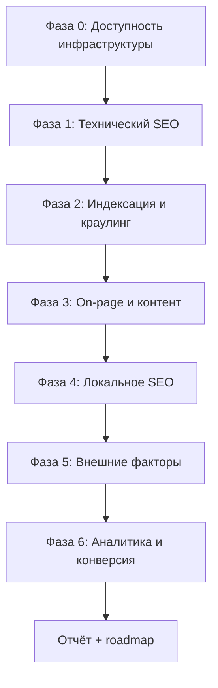

# План детального SEO-аудита ps-invest.ru

**Проект:** Профсталь-инвест (Astro SSR, VPS Reg.ru)  
**Домен:** `ps-invest.ru` + поддомены городов и категорий  
**Поисковики:** приоритет **Яндекс**, вторично Google  
**Дата плана:** 2025

---

## 1. Цели аудита

| Цель | Метрика успеха |
|------|----------------|
| Индексация всех коммерческих URL | ≥90% URL из sitemap в индексе Яндекса за 60 дней |
| Локальные запросы ДНР | Топ-30 по «металлопрокат + город», «категория + город» |
| Товарные запросы | Индексация 195 карточек + рост city×product landing |
| Техническое здоровье | 0 критических ошибок в Вебмастере, Core Web Vitals «зелёный» |
| Конверсия из органики | Рост заявок/звонков из Метрики (цели настроены) |

---

## 2. Инвентарь URL (базовая линия)

| Тип страницы | Кол-во | Канонический формат | Файл/маршрут |
|--------------|--------|---------------------|--------------|
| Статика | 6 | `ps-invest.ru/...` | `/`, `/catalog/`, `/cities/`, `/about/`, `/contacts/`, `/delivery/` |
| Города | 10 | `donetsk.ps-invest.ru/` | middleware rewrite |
| Категории | 12 | `sortovoy-prokat.ps-invest.ru/` | middleware rewrite |
| Город × категория | 120 | `donetsk.ps-invest.ru/sortovoy-prokat/` | `cities/[slug]/[categorySlug]` |
| Товары | 195 | `{category}.ps-invest.ru/{slug}/` | `catalog/.../[productSlug]` |
| Город × товар | 1950 | `donetsk.ps-invest.ru/{cat}/{slug}/` | `cities/.../.../[productSlug]` |
| **Итого в sitemap** | **~2293** | | `sitemap-index.xml` |

**Sitemap-файлы для проверки:**
- `/sitemap-index.xml` — главный для Вебмастера
- `/sitemap-seo.xml` — статика + поддомены + город×категория
- `/sitemap-catalog.xml` — товары
- `/sitemap-city-products.xml` — 1950 landing
- `/sitemap-subdomains.xml` — поддомены
- `/robots.txt` — динамический

---

## 3. Фазы аудита



---

## Фаза 0. Инфраструктура (блокер — без этого аудит бессмысленен)

**Срок:** 1 день  
**Ответственный:** админ VPS + DNS

| # | Проверка | Как проверить | Критерий PASS | Статус |
|---|----------|---------------|---------------|--------|
| 0.1 | DNS A `@` | `nslookup ps-invest.ru 8.8.8.8` | IP = VPS | ☐ |
| 0.2 | DNS wildcard `*` | `nslookup donetsk.ps-invest.ru` | тот же IP | ☐ |
| 0.3 | HTTPS apex | `curl -I https://ps-invest.ru` | 200, валидный SSL | ☐ |
| 0.4 | HTTPS поддомен | `curl -I https://donetsk.ps-invest.ru` | 200, wildcard SSL | ☐ |
| 0.5 | www → apex | `curl -I https://www.ps-invest.ru` | 301 → `ps-invest.ru` | ☐ |
| 0.6 | Docker / app | `curl https://ps-invest.ru/api/telegram/status` | `hint: ok` | ☐ |
| 0.7 | Volumes | правка в боте → redeploy | данные сохраняются | ☐ |
| 0.8 | `.env` | `PUBLIC_SITE_URL`, `PUBLIC_SITE_DOMAIN` | совпадают с продом | ☐ |

---

## Фаза 1. Технический SEO

**Срок:** 2–3 дня  
**Инструменты:** curl, Screaming Frog (или Sitebulb), Яндекс.Вебмастер → «Проверка ответа сервера»

### 1.1 Редиректы и каноникал

| # | Проверка | URL-примеры | Ожидание |
|---|----------|-------------|----------|
| 1.1.1 | Город path → поддомен | `/cities/donetsk/` | 301 → `https://donetsk.ps-invest.ru/` |
| 1.1.2 | Категория path → поддомен | `/catalog/sortovoy-prokat/` | 301 → `https://sortovoy-prokat.ps-invest.ru/` |
| 1.1.3 | Товар path → поддомен категории | `/catalog/{cat}/{slug}/` | 301 → `{cat}.ps-invest.ru/{slug}/` |
| 1.1.4 | Город×категория path | `/cities/donetsk/sortovoy-prokat/` | 301 → `donetsk.ps-invest.ru/sortovoy-prokat/` |
| 1.1.5 | Город×товар path | `/cities/donetsk/{cat}/{slug}/` | 301 → `donetsk.ps-invest.ru/{cat}/{slug}/` |
| 1.1.6 | `<link rel="canonical">` | 10 случайных URL каждого типа | = канонический поддомен, без дублей |
| 1.1.7 | Нет цепочек редиректов | все выше | максимум 1 hop |

### 1.2 robots.txt и sitemap

| # | Проверка | Ожидание |
|---|----------|----------|
| 1.2.1 | `/robots.txt` отдаёт 200 | User-agent Yandex, Allow /, Disallow /admin/, /api/ |
| 1.2.2 | Sitemap в robots | 5 URL sitemap с актуальным доменом |
| 1.2.3 | `sitemap-index.xml` | 4 дочерних sitemap, все 200 |
| 1.2.4 | Кол-во URL в sitemap | ~2293 уникальных `<loc>` |
| 1.2.5 | Нет битых URL в sitemap | выборочно 50 URL → HTTP 200 |
| 1.2.6 | `/admin/` | noindex + Disallow |

### 1.3 Разметка Schema.org

| # | Тип | Где проверить | Инструмент |
|---|-----|---------------|------------|
| 1.3.1 | LocalBusiness | главная, контакты | validator.schema.org |
| 1.3.2 | WebSite + SearchAction | главная | validator.schema.org |
| 1.3.3 | Product + Offer | карточка товара | validator.schema.org |
| 1.3.4 | BreadcrumbList | товар, категория | validator.schema.org |
| 1.3.5 | FAQPage | товар, город×категория | validator.schema.org |
| 1.3.6 | ItemList | категория | validator.schema.org |
| 1.3.7 | NAP в schema = видимый текст | телефон, адрес | ручная сверка |

### 1.4 Meta и Open Graph

| # | Проверка | Выборка |
|---|----------|---------|
| 1.4.1 | Уникальный `<title>` | 20 товаров, 10 city×product, 5 категорий |
| 1.4.2 | Уникальный `description` 120–160 символов | та же выборка |
| 1.4.3 | Один H1 на страницу | все типы шаблонов |
| 1.4.4 | `og:title`, `og:url`, `og:image` | 10 страниц |
| 1.4.5 | `yandex-verification` | исходный код главной |
| 1.4.6 | `lang="ru"` | Layout |

### 1.5 Производительность (Core Web Vitals)

| # | Метрика | Цель | Инструмент |
|---|---------|------|------------|
| 1.5.1 | LCP | < 2.5s | PageSpeed / Вебмастер |
| 1.5.2 | INP / FID | < 200ms | PageSpeed |
| 1.5.3 | CLS | < 0.1 | PageSpeed |
| 1.5.4 | TTFB | < 600ms | WebPageTest |
| 1.5.5 | Изображения | lazy-load, width/height | ручной осмотр каталога |
| 1.5.6 | Шрифты Google | preconnect есть; оценить self-host | Lighthouse |

**Типичные страницы для теста:** главная, категория SSR, товар, city×product, мобильная версия.

### 1.6 Мобильная версия

| # | Проверка |
|---|----------|
| 1.6.1 | Mobile-Friendly (Вебмастер) |
| 1.6.2 | Viewport meta |
| 1.6.3 | Кликабельные телефон / заявка / меню |
| 1.6.4 | MobileBar не перекрывает контент |

---

## Фаза 2. Индексация и краулинг (Яндекс.Вебмастер)

**Срок:** после Фазы 0, мониторинг 2–4 недели  
**Предусловие:** сайт добавлен, `PUBLIC_YANDEX_VERIFICATION` задан, sitemap отправлен

| # | Раздел Вебмастера | Что смотреть | Действие при FAIL |
|---|-------------------|--------------|-------------------|
| 2.1 | Индексирование → Страницы в поиске | рост после отправки sitemap | проверить DNS, robots |
| 2.2 | Исключённые страницы | дубли, редиректы, ошибки | исправить canonical |
| 2.3 | Дубли title/description | >5% страниц | доработать шаблоны / overrides |
| 2.4 | Ошибки обхода | 4xx, 5xx, таймауты | логи nginx, docker |
| 2.5 | Файлы Sitemap | «Обработан», без ошибок | валидность XML |
| 2.6 | Регион сайта | Донецк / ДНР | настроить вручную |
| 2.7 | Главное зеркало | `https://ps-invest.ru` | без www |
| 2.8 | Проверка ответа сервера | 10 URL каждого типа | код 200, контент совпадает |
| 2.9 | Турбо / мобильные страницы | не требуется | — |

### Выборочная проверка индекса (ручная)

```
site:ps-invest.ru
site:donetsk.ps-invest.ru
site:sortovoy-prokat.ps-invest.ru
site:ps-invest.ru inurl:mtl-
```

Зафиксировать: сколько URL в выдаче vs 2293 в sitemap.

---

## Фаза 3. On-page и контент

**Срок:** 3–5 дней анализа + ongoing

### 3.1 Шаблоны страниц

| Шаблон | Title/H1 | Уникальный текст | FAQ | Риск |
|--------|------------|------------------|-----|------|
| Главная | ✓ | средний | нет | низкий |
| Категория (поддомен) | ✓ | seoText в categories.json | нет | низкий |
| Город (поддомен) | ✓ | cities.json | нет | низкий |
| Город×категория | ✓ | overrides 120 пар | ✓ | низкий |
| Товар | ✓ auto | description в products.json | ✓ | средний |
| Город×товар | ✓ auto | шаблон + city | ✓ | **высокий — thin content** |

### 3.2 Аудит тонкого контента (критично для 1950 landing)

| # | Действие | Приоритет |
|---|----------|-----------|
| 3.2.1 | Выгрузить 50 случайных city×product URL | P0 |
| 3.2.2 | Сравнить % уникального текста (должен быть >40% между городами) | P0 |
| 3.2.3 | Топ-30 SKU × топ-5 городов → ручные overrides в `product-seo-overrides.json` | P1 |
| 3.2.4 | Добавить блок «доставка в {город}» уникальный из `cities.json` | уже есть — проверить |
| 3.2.5 | Перелинковка «другие города» на товаре | ✓ есть — проверить анкоры |

### 3.3 Каталог и товары

| # | Проверка |
|---|----------|
| 3.3.1 | 195 товаров: у всех есть title, description, image |
| 3.3.2 | Placeholder-изображения (`placeholder-product.svg`) — список и замена |
| 3.3.3 | specsRaw заполнен |
| 3.3.4 | Внутренние ссылки: категория → товары → похожие |
| 3.3.5 | Поиск (`/api/search`) не индексируется |

### 3.4 Дубли контента

| Пара страниц | Риск | Митигация |
|--------------|------|-----------|
| Товар vs город×товар | высокий | разный canonical, разный title/H1, локальный текст |
| path URL vs поддомен | средний | 301 на поддомен ✓ |
| sitemap-subdomains vs sitemap-seo | низкий | дубли URL в разных sitemap допустимы |
| 10 городов × один товар | высокий | overrides для топ-позиций |

---

## Фаза 4. Локальное SEO (ДНР)

**Срок:** 1 неделя настройки + 2 недели на модерацию

| # | Канал | Проверка NAP | Ссылка на сайт |
|---|-------|--------------|----------------|
| 4.1 | Яндекс.Бизнес | имя, телефон, адрес, график | ps-invest.ru |
| 4.2 | Яндекс.Карты | метка, фото, категория | PUBLIC_YANDEX_MAPS_URL |
| 4.3 | 2GIS | карточка | PUBLIC_2GIS_URL |
| 4.4 | Сайт /contacts | = Бизнес | карта iframe |
| 4.5 | Schema sameAs | telegram, maps, 2gis | Layout |
| 4.6 | Бот → 🏢 Контакты | телефон на сайте = Бизнес | ручная сверка |

### Локальные landing

| # | Проверка |
|---|----------|
| 4.7 | 10 поддоменов городов открываются |
| 4.8 | 120 страниц город×категория с уникальными overrides |
| 4.9 | Запросы «{категория} {город}» → landing в sitemap |

---

## Фаза 5. Внешние факторы

**Срок:** ongoing

| # | Действие | Приоритет |
|---|----------|-----------|
| 5.1 | Ссылки с Яндекс.Бизнес, 2GIS на apex | P0 |
| 5.2 | Отраслевые каталоги (Пром.ру, Allbiz) | P2 |
| 5.3 | Региональные справочники ДНР | P2 |
| 5.4 | Соцсети / Telegram-канал со ссылкой | P1 |
| 5.5 | Анализ ссылочного профиля (Вебмастер → «Ссылки») | P1 |

---

## Фаза 6. Аналитика и конверсия

**Срок:** 1 день настройки + еженедельный мониторинг

| # | Проверка | Инструмент |
|---|----------|------------|
| 6.1 | Метрика установлена | исходный код, счётчик активен |
| 6.2 | Цели: phone_click, lead_submit, telegram_click, whatsapp_click | тест-клики |
| 6.3 | Вебвизор включён | настройки счётчика |
| 6.4 | UTM в рекламе (если будет) | Clean-param в robots ✓ |
| 6.5 | Отчёт «Источники → Поисковые системы» | еженедельно |
| 6.6 | Landing pages органики | топ-20 URL по визитам |

---

## 4. Матрица приоритетов (roadmap после аудита)

### P0 — критично (неделя 1)

1. DNS `*` + SSL wildcard на VPS
2. Яндекс.Вебмастер + sitemap-index + регион
3. Яндекс.Метрика + цели
4. NAP единый (сайт = Бизнес = Карты)
5. Проверка 301 и canonical на всех типах URL
6. Исправление 4xx/5xx из краулера

### P1 — высокий (недели 2–4)

1. Overrides для топ-50 товаров × 3 города
2. Замена placeholder-изображений
3. PageSpeed: LCP на каталоге и товарах
4. Мониторинг «дубли title» в Вебмастере
5. Google Search Console (дополнительно)

### P2 — средний (месяц 2)

1. Self-host шрифтов
2. WebP для catalog-images
3. Блок отзывов / кейсов на главной
4. Расширение cities.json (+5 городов)
5. Отраслевые каталоги

### P3 — низкий

1. A/B заголовков на главной
2. Блог / статьи («как выбрать профнастил»)
3. RSS / Turbo-страницы Яндекса

---

## 5. Инструменты аудита

| Инструмент | Назначение |
|------------|------------|
| [Яндекс.Вебмастер](https://webmaster.yandex.ru) | индекс, ошибки, регион |
| [Яндекс.Метрика](https://metrika.yandex.ru) | трафик, цели, вебвизор |
| [validator.schema.org](https://validator.schema.org) | микроразметка |
| Screaming Frog / Sitebulb | краул до 2293 URL |
| PageSpeed Insights | CWV |
| `curl`, `nslookup` | редиректы, DNS |
| `npm run build` | регрессии после правок |

### Команды быстрой проверки (на проде)

```bash
curl -s https://ps-invest.ru/robots.txt
curl -s https://ps-invest.ru/sitemap-index.xml | head -30
curl -sI https://ps-invest.ru/cities/donetsk/ | grep -i location
curl -sI https://www.ps-invest.ru/ | grep -i location
curl -s https://ps-invest.ru/ | grep -E 'canonical|yandex-verification|mc.yandex'
```

---

## 6. Шаблон отчёта аудита

Заполнить после прохождения фаз 0–6:

```
Дата аудита: ___________
Аудитор: ___________
Версия сайта (git commit): ___________

Сводка:
- Критических проблем: __
- Высоких: __
- Средних: __
- Низких: __

Индексация (Яндекс):
- URL в sitemap: ~2293
- URL в индексе (site:): __
- % покрытия: __%

Core Web Vitals (мобильный):
- LCP: __  INP: __  CLS: __

Топ-5 проблем:
1.
2.
3.
4.
5.

Roadmap на 30 дней:
...
```

---

## 7. Известные риски проекта (на момент плана)

| Риск | Влияние | Статус митигации |
|------|---------|------------------|
| DNS wildcard не настроен | поддомены не работают | ☐ вручную Reg.ru |
| 1950 city×product — шаблонный текст | фильтр Яндекса за thin content | частично: FAQ + city intro |
| Дубли товар / city×товар | конкуренция URL в индексе | canonical разный ✓ |
| Astro prerender cities vs SSR products | разное поведение кэша | проверить на VPS |
| Заглушки телефона/email в .env | NAP mismatch | заполнить + бот |
| Нет Google Search Console | потеря трафика Google | P1 |

---

## 8. Регулярный мониторинг (после аудита)

| Частота | Действие |
|---------|----------|
| Еженедельно | Вебмастер: ошибки, дубли, индекс |
| Еженедельно | Метрика: органика, цели, landing |
| Ежемесячно | Краул 100 случайных URL из sitemap |
| При добавлении товара в боте | проверка sitemap-catalog + city×product |
| При смене контактов | сверка NAP везде |

---

## 9. Связанные документы

- [yandex-setup.md](./yandex-setup.md) — настройка Яндекса
- [deploy-vps-regru.md](./deploy-vps-regru.md) — деплой VPS
- [seo-external-checklist.md](./seo-external-checklist.md) — краткий чеклист
- [telegram-bot-audit.md](./telegram-bot-audit.md) — бот и каталог
