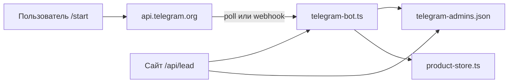

# Аудит Telegram-бота @proffinvest23_bot

Дата аудита: 2025. Бот: админка каталога + приём заявок с сайта.

## Архитектура



| Компонент | Файл | Назначение |
|-----------|------|------------|
| Автостарт | `telegram-server.ts` | poll/webhook при `npm start` |
| Long polling | `telegram-poll-runner.ts` | getUpdates в фоне |
| Webhook | `api/telegram/webhook.ts` | POST от Telegram |
| Обработка | `telegram-bot.ts` | /start, меню, поиск |
| Админка каталога | `telegram-admin-bot.ts` | CRUD товаров |
| Админы | `telegram-admins.json` | chat_id получателей заявок |
| API Telegram | `telegram-api.ts` | undici + опциональный прокси |

## Найденные проблемы и исправления

### 1. Критично: бот не стартовал до первого визита на сайт

**Было:** `ensureTelegramBotRunning()` вызывался только в middleware при HTTP-запросе. Если никто не открывал сайт — poll не запускался, `/start` игнорировался.

**Исправлено:** `scripts/start-server.ts` запускает бота **до** HTTP-сервера. Railway/Docker: `npm start`.

### 2. Критично: конфликт webhook + poll

**Было:** если на боте остался webhook (старый деплой, ручная настройка), Telegram **не отдаёт** сообщения в getUpdates. Poll «работает», но updates пустые — бот молчит.

**Исправлено:** при старте poll вызывается `deleteWebhook`. Диагностика: `npm run telegram:check` и `GET /api/telegram/status`.

### 3. TELEGRAM_MODE=webhook без рабочего домена

**Было:** при `TELEGRAM_MODE=webhook` poll не запускается. Если `ps-invest.ru` не указывает на сервер — сообщения теряются.

**Рекомендация:** на Railway оставить **`TELEGRAM_MODE=poll`** (по умолчанию) до привязки домена. Webhook — только когда DNS настроен.

### 4. Webhook secret только из import.meta.env

**Было:** `webhook.ts` читал секрет только из build-time env → 403 на все webhook-запросы на Railway.

**Исправлено:** `process.env.TELEGRAM_WEBHOOK_SECRET` + fallback.

### 5. /start — двойной вызов addTelegramAdmin

**Было:** админ добавлялся дважды → всегда текст «Вы уже подключены» вместо «Админка подключена».

**Исправлено:** один вызов, корректное приветствие.

### 6. NODE_ENV не был production в Docker

**Было:** автостарт мог не сработать вне Railway.

**Исправлено:** `ENV NODE_ENV=production` в Dockerfile, автостарт также при `PORT`.

### 7. Локально: блокировка api.telegram.org (ДНР/РФ)

**Симптом:** `connect ETIMEDOUT 149.154.166.110:443` при `npm run telegram:check`.

**Решение:** VPN + `TELEGRAM_PROXY=socks5://127.0.0.1:1080` или тестировать бота на Railway (там API доступен).

## Чеклист «бот не отвечает на /start»

1. **Railway Variables:** `TELEGRAM_BOT_TOKEN` задан (без пробелов)?
2. **Режим:** `TELEGRAM_MODE` не `webhook` OR домен `PUBLIC_SITE_URL` реально открывает ваш сервер?
3. **Логи Railway:** есть строка `[telegram] Long polling — @proffinvest23_bot`?
4. **Статус:** открыть `https://ваш-домен/api/telegram/status` — `apiOk: true`, `started: true`, `pollBlockedByWebhook: false`
5. **Webhook:** `npm run telegram:webhook:off` или дождаться автоснятия при poll
6. **Локально:** без VPN poll не работает — это нормально для ДНР
7. **Токен:** не отозван в BotFather?

## Команды

```powershell
npm run telegram:check      # диагностика с ПК
npm run telegram:poll         # локальный poll (нужен VPN в ДНР)
npm run telegram:webhook:off    # снять webhook
npm run telegram:test         # тестовое сообщение админам
curl https://ваш-сайт/api/telegram/status
```

## Railway Variables (минимум)

```
TELEGRAM_BOT_TOKEN=...
ADMIN_PASSWORD=...
PUBLIC_SITE_URL=https://ps-invest.ru
PUBLIC_SITE_DOMAIN=ps-invest.ru
```

Опционально:

```
TELEGRAM_MODE=poll          # по умолчанию, рекомендуется
TELEGRAM_PROXY=             # только локально
TELEGRAM_WEBHOOK_SECRET=    # только для webhook mode
TELEGRAM_AUTO_START=0       # отключить автостарт
```

## Volumes (чтобы админы не сбрасывались)

- `/app/data` → `telegram-admins.json`

## Поведение /start (ожидаемое)

1. Пользователь пишет `/start`
2. Chat ID сохраняется в `data/telegram-admins.json`
3. Бот отвечает «Админка подключена» + клавиатура (Каталог, Найти, Новый товар, Помощь)
4. Заявки с сайта уходят всем chat_id из списка

## Что проверить после деплоя

1. Логи: `[telegram] Старт (mode=poll, token=ok)`
2. Логи: `[telegram] Long polling — @proffinvest23_bot`
3. `/api/telegram/status` → `"hint": "ok"`
4. Написать боту `/start` — ответ в течение 1–2 сек
